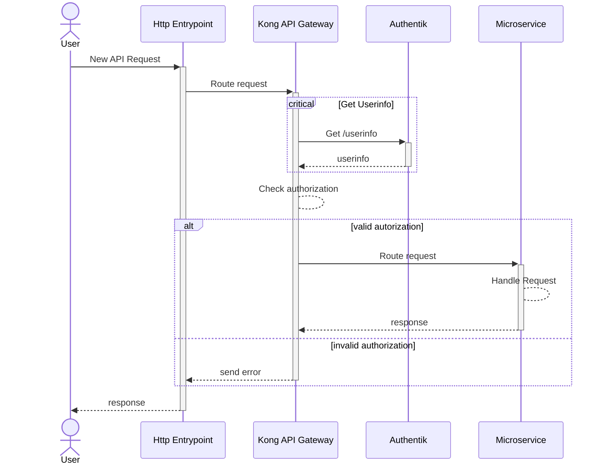

# Backend Overview
The Backend consists of three major parts:
 * [Kong API Gateway](kong.md) 
   ([ext. Website](https://docs.konghq.com/gateway/latest/))
 * [Authentik](authentik.md) 
   ([ext. Website](https://goauthentik.io/docs/))
 * [Microservices](microservices.md)

All three parts and their dependencies are running in Docker Containers managed
by [Docker Compose](https://docs.docker.com/compose/) using a 
[docker-compose.yml](https://github.com/wisdom-oss/deployment/blob/main/docker-compose.yml)
file.
> 🚨 The linked `docker-compose.yml` file is currently under rework. The content
> of this file may change or be temporarily unavailable.

## Kong API Gateway
)

The Kong API Gateway is responsible for routing incoming requests to the
microservices after validating the authorization contained in the request at
the authentik service.

 Example Request Flow

More information: [here](./kong/kong.md)

## Authentik

Authentik is responsible for managing the authorization for this project.
It allows authentification and authorization via multiple providers like
* LDAP
* OAuth 2.0 (including Open ID Connect) (✅ used in this project)
* SAML

and even allows protecting applications that cannot use those providers via
proxy authentification.

It also allows the usage of external authentification sources like:
* Azure AD
* GitHub.com or a GitHub-Enterprise server
* LDAP
* OpenID Connect
* SAML

More information: [here](./authentik/authentik.md)