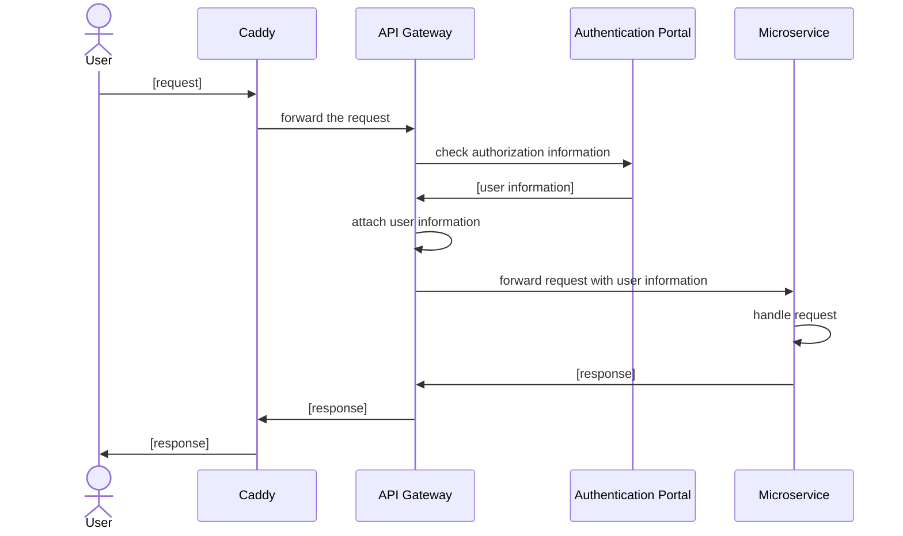

# Backend Overview
The backend of the WISdoM project is designed as microservice architecture
containing the following major core parts:
* [authentik](https://goauthentik.io)
* [Kong API Gateway](https://docs.konghq.com/gateway/latest/)
* [Postres](https://www.postgresql.org/) with the 
  [PostGIS extension](https://postgis.net/)
* [Service Detection](https://github.com/wisdom-oss/gateway-service-watcher)

These four parts manage the routing and authentication for the microservices
behind the API gateway.

## Architecture
As already mentioned, the backend is constructed as microservice architecture
allowing the creation of multiple instances of one service if a large number
of requests are expected for this single service.

## Deployment
To allow a unified deployment of the core project (the frontend, and the listed
core parts) the project uses [Docker](https://www.docker.com) together with 
[Docker Compose](https://docs.docker.com/compose/) as deployment mechanism.

[_Read more_](./deployment.md)

## Microservices
Since the selected architecture is a microservice architecture, the creation of
a new microservice is pretty straightforward. Just use the 
[template](https://github.com/wisdom-oss/microservice-template) for writing
a service in [Golang](https://go.dev).

[_Read more_](./development/README.md)

## Request flow

This sequence diagram tries to show the default flow of a request in the
WISdoM platform. It removes some steps like the determination of a route in
a participant to make the flow better comprehensible 

> If the user is not authenticated, the gateway responds with an error message 
> to let the user know that he needs authentication for the request.

## Notes
### Emojis
Throughout the backend documentation, emojis are used to mark important steps
and notes.
If an emoji appears at the top of a page, the emoji is valid for the whole page
and the actions/commands listed on it!
To make the usage unified, here are some predefined emojis with their
meanings:

| **Emoji** | **Description**                                                      |
|-----------|----------------------------------------------------------------------|
| 🛑        | This step might impact the system stability                          |
| 🦺        | This step might impact the system security                           |
| ✨         | This step is the recommended step in a selection of steps            |
| 🔐        | This step requires administrative privileges on the host             |
| 🚧        | This step is still a work in progress and may not behave as expected |

