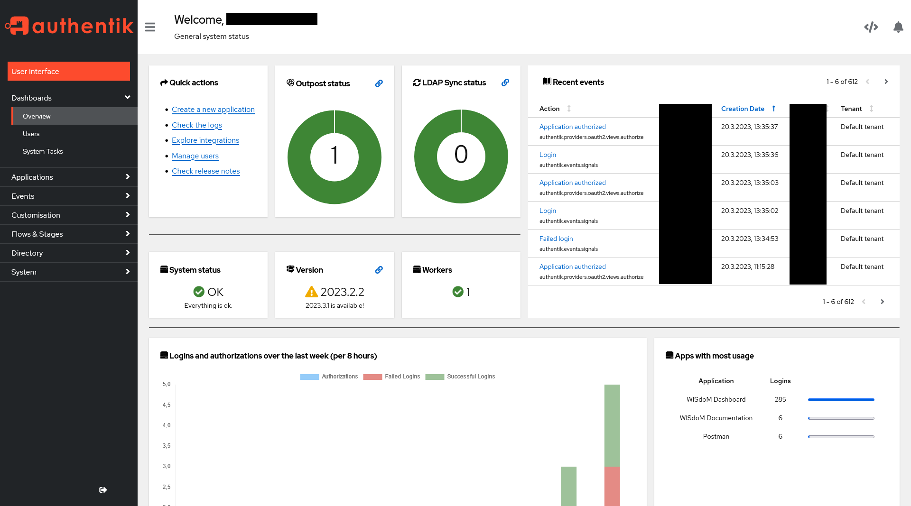
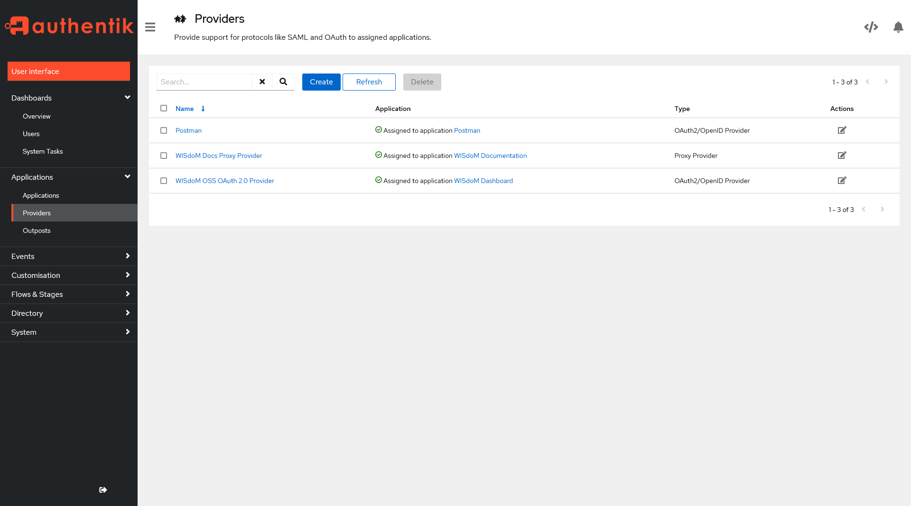

  

# Creating a `OAuth2/OpenID` Provider

1. Open the administrative UI of your authentik installation  
    `https://<your-authentik-binding>/if/admin/`
    

    
Click to show/hide screenshot

    
    

2. Now navigate to the Providers using the left sidebar `Applications/Providers`
    

    
Click to show/hide screenshot

    
    

3. Now Create a new `OAuth2/OpenID` provider with the client type set to 
    `public`.

4. Now set the `Client ID` in the frontend as described in the aproppriate documentation