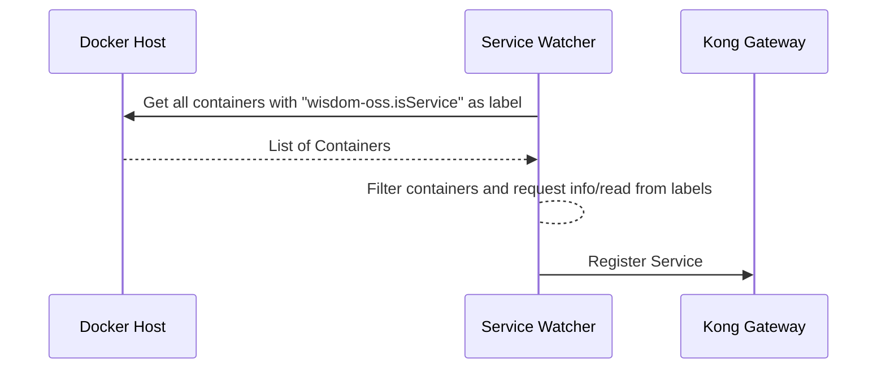

# API Gateway and Service Registration
The project uses the Kong API Gateway as API Gateway.
The gateway is extended by a plugin which allows the gateway to request the
userinfo endpoint of the authentik server.

## Service Registration
The project uses a worker container which scans the docker host for services
which are marked with the label `wisdom-oss.isService` set to `true`.

    
Sequence Diagram

